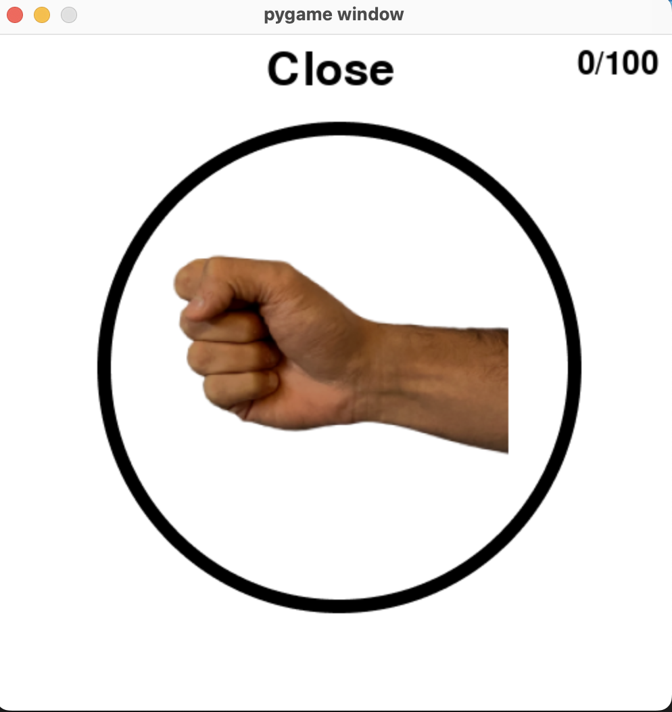
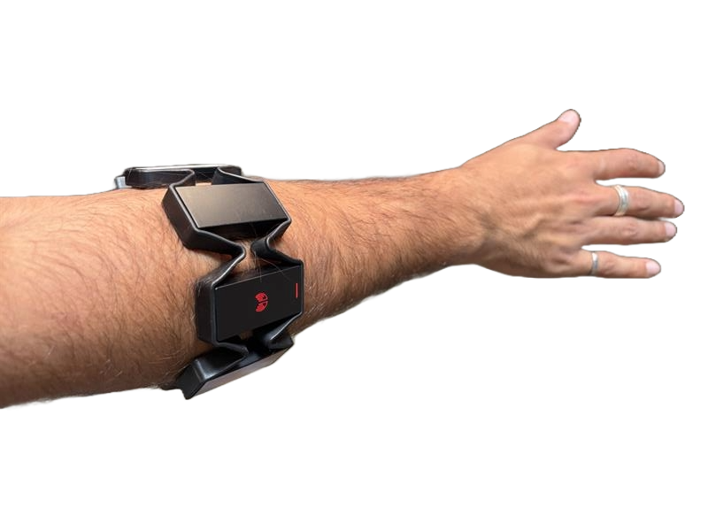

# Discrete Cross User Models 

## Training Offline Model
To train the offline model run `train_model.py`. You can change three parameters `model`, `cnn`, and `layers`. We used `MODEL=GRU`, `CNN=true`, and `LAYERS=3`. Make sure that you correctly download dataset.pkl from the following URL: [data](https://drive.google.com/file/d/1kKxVfaFp4RdDebwQj7oBp80IuR3F6T7Y/view?usp=sharing)

## Running Online Model 
Start by running `run_discrete.py`. After feeling the armband buzz, in a seperate terminal run `discrete_test.py` to start the GUI. The two will communciate via UDP over localhost. 

## Armband Orientataion
Make sure the LED is on the extensor muscle and the USB port is facing down. 

